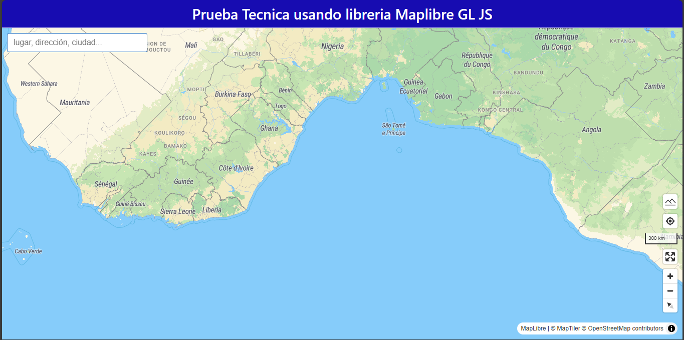
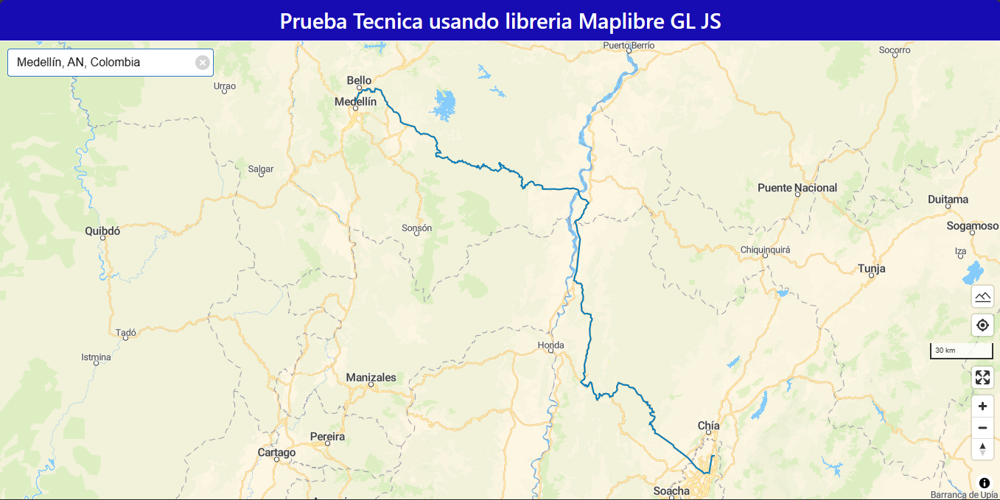

# Prueba técnica usando la librería Maplibre-gl-js

## Descripción

Este proyecto es una prueba técnica que consiste en la creación de un mapa interactivo utilizando la librería Maplibre-gl-js. El mapa debe mostrar la ubicación de los usuarios en tiempo real y con base ello, si el usuario quiere buscar un destino dar la ruta mas optima para llegar a ese sitio usando como transporte en carro.

## Librerias y Api usadas

- [Maplibre-gl-js](https://maplibre.org/maplibre-gl-js/docs/)
- React
- Geolocated
- React-Router-Dom
- [Openrouteservice-js](https://openrouteservice.org/)
- [Vite](https://vitejs.dev/guide/)
- [SWC](https://swc.rs/docs/getting-started)

# Guía de uso
## Vista inicial

Si el usuario busca un destino, el mapa le mostrará la ruta más optima para llegar a ese destino en carro.

## Vista de la ruta

## Caracteristicas 
- El mapa muestra la ubicación del usuario en tiempo real.
- El usuario puede buscar un destino y el mapa le mostrará la ruta más optima para llegar a ese destino en carro.
- El mapa accede a la ubicación del usuario por defecto.
- El sistema permite hacer zoom in y zoom out.
- El sistema permite moverse por el mapa.
- El sistema permite cambiar la vista del mapa a pantalla completa.

